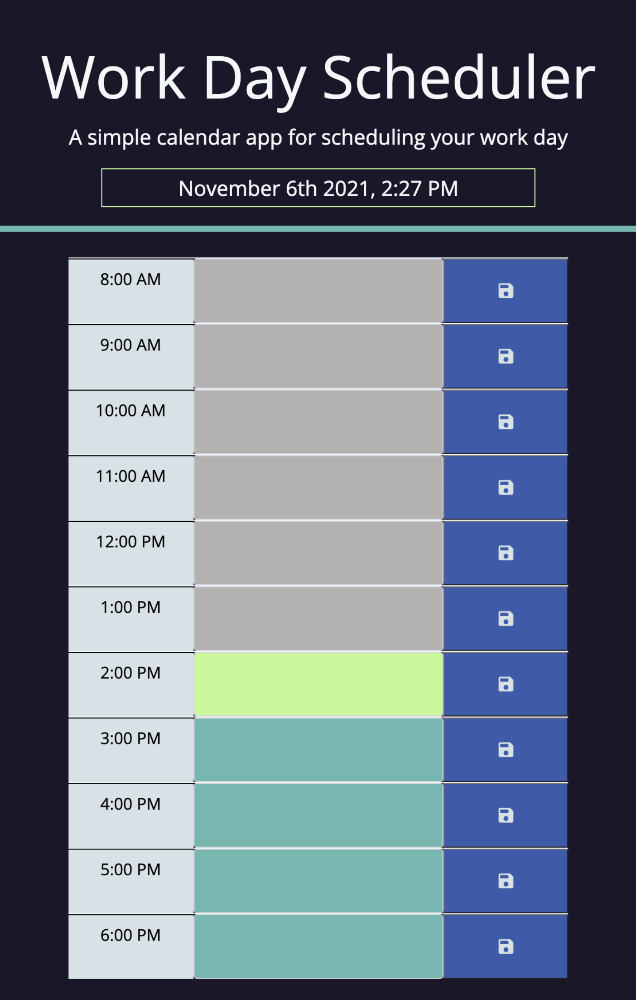
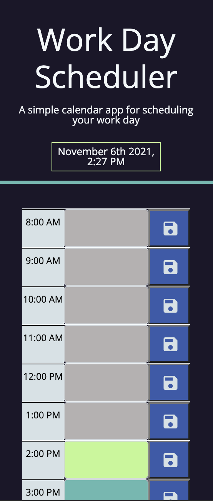
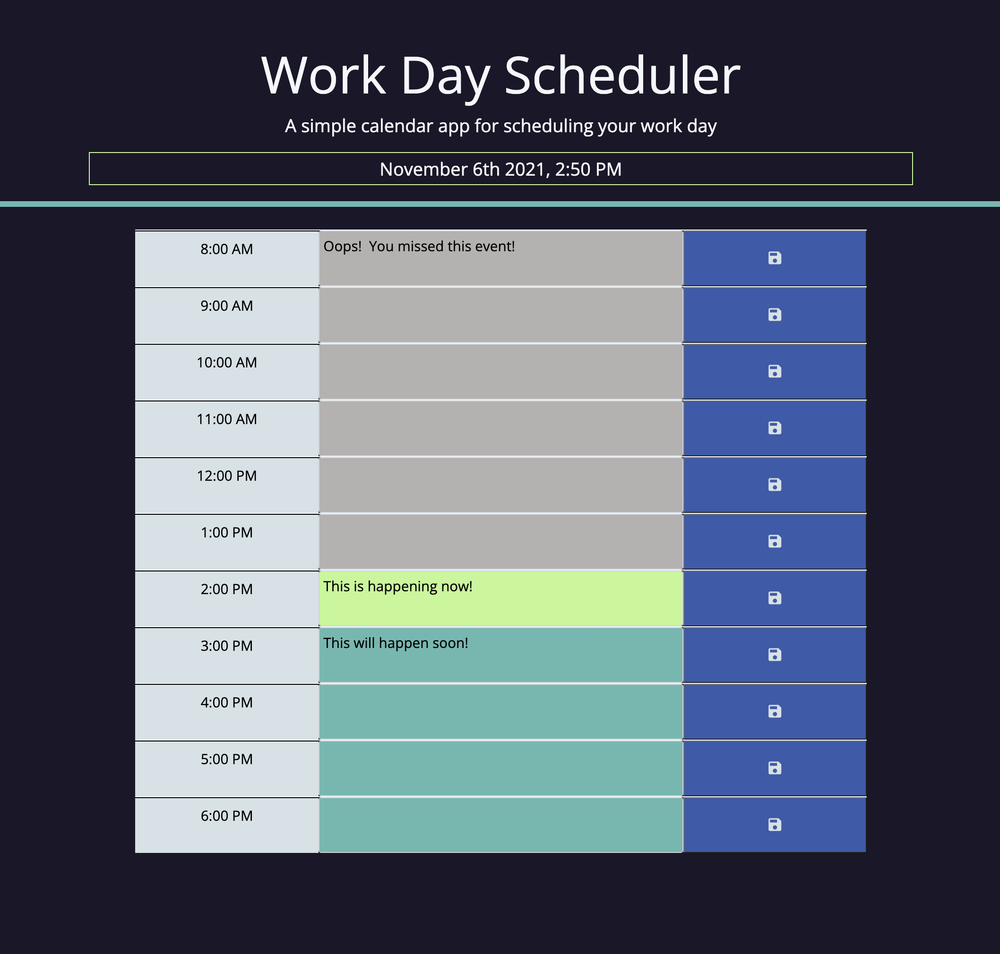

# Work Day Scheduler

## Purpose
***
To develop a workday planner with daily schedule where user can save events for each hour of the work day. It will run in the browser and have a clean, responsive and intuitive user interface. 

&nbsp;

## Desired
***
- Upon opening, current day is displayed at top
- Upon scrolling down, presented with standard business-hour time blocks
- When time blocks are viewed, each is color-coded to indicate whether it is in the past, present or future
-  When a time block is clicked, can enter an event and click save button to save it (ie text saves to local storage)
- When refresh the page, saved events persist

&nbsp;

## Scheduler URL
***
Link to the quiz here *[Work Day Scheduler](https://melliedee.github.io/scheduler/)*.

&nbsp;

## Resources and Languages Used
***
- HTML
- CSS
- JS & jQuery
- moment.js library for dealing with dates and times in JavaScript
- Google Font Material Icons
- template literals - note - potentially not supported in Internet Explorer

&nbsp;

## Screen Shots
***

&nbsp;

### Icon Licensing
***
https://developers.google.com/fonts/docs/material_icons

"...We have made these icons available for you to incorporate them into your products under the Apache License Version 2.0. Feel free to remix and re-share these icons and documentation in your products. We'd love attribution in your app's about screen, but it's not required. The only thing we ask is that you not re-sell the icons themselves..."

&nbsp;

### Resources I used or was inspired by...
***

Serena Chandler (tutor) and TAs - for discussion of localStorage & template literals, and for loops

https://github.com/Giselesoubeiga/Day-Planner/blob/master/script.js

https://colorhunt.co/palette/2b1f31413d655fb9b0bef992
https://colorhunt.co/palette/151515301b3f3c415cb4a5a5

https://developers.google.com/fonts/docs/material_icons

https://www.geeksforgeeks.org/how-to-add-and-remove-multiple-classes-in-jquery/

https://stackoverflow.com/questions/6205258/jquery-dynamically-create-button-and-attach-event-handler

https://pretagteam.com/question/how-can-we-dynamically-change-font-color-in-textarea-using-angularjqueryjavascript

https://blog.jscrambler.com/a-momentjs-in-time#:~:text=To%20get%20the%20current%20date,in%20the%20current%20time%20zone.

https://developer.mozilla.org/en-US/docs/Web/JavaScript/Reference/Global_Objects/Date/getHours

https://stackoverflow.com/questions/26783080/convert-12-hour-am-pm-string-to-24-date-object-using-moment-js

https://stackoverflow.com/questions/46141450/create-li-from-loop-through-array-and-display-to-html-as-a-list

https://stackoverflow.com/questions/40394282/how-to-format-custom-time-in-moment-js